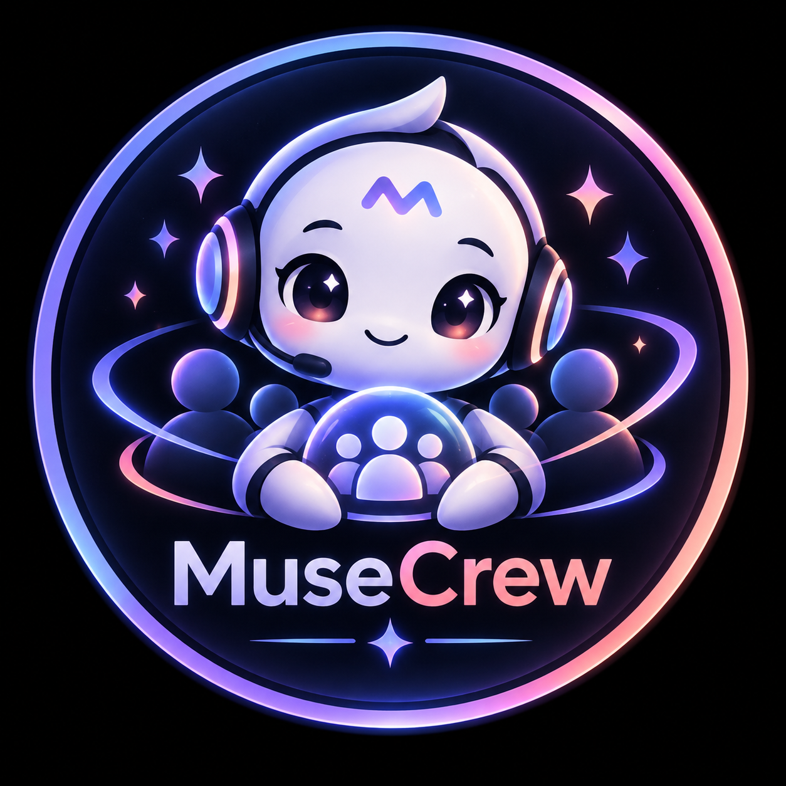
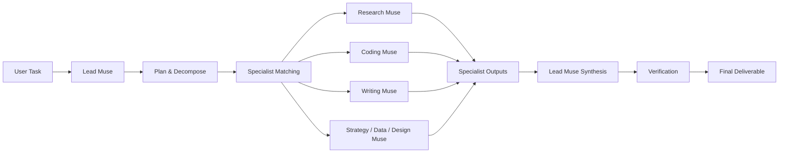

<div align="center">
  

  # MuseCrew

  **A multi-agent AI workspace that assembles specialist muses to plan, execute, verify, and deliver real work.**

  [**Live App → musecrew.app**](https://musecrew.app)

  `Multi-Agent Orchestration` · `Anthropic Claude` · `Vercel` · `Serverless`
</div>

---

## What is MuseCrew?

MuseCrew turns one user task into a coordinated AI workflow.

Instead of sending the entire request to a single generic assistant, MuseCrew decomposes the task, matches the work to specialist agents, runs those specialists in parallel, and uses a Lead Muse to synthesize the final result.

```text
ONE TASK
   ↓
LEAD MUSE
   ↓
PLAN + DECOMPOSE
   ↓
MATCH SPECIALISTS
   ↓
EXECUTE IN PARALLEL
   ↓
VERIFY
   ↓
FINAL DELIVERABLE
```

The current production build is live at **[musecrew.app](https://musecrew.app)**.

---

## How it works



Each run creates a visible execution path and a receipt that records the task, selected crew, match scores, verification state, and final output.

---

## Specialist Muse Network

MuseCrew currently ships with a registry of specialist agents built around different work profiles:

| Muse | Primary role | Example capabilities |
|---|---|---|
| **Research Muse** | Research Specialist | web research, sources, synthesis |
| **Coding Muse** | Software Builder | code, APIs, JavaScript, Python |
| **Writing Muse** | Content Synthesizer | writing, editing, structured output |
| **Data Muse** | Data Analyst | analysis, structured data, insights |
| **Design Muse** | Product Designer | UI, UX, visual direction |
| **Web Muse** | Web Operator | browsing, scraping, research |
| **Verification Muse** | Quality Verifier | QA, review, fact-checking |
| **Strategy Muse** | Lead Planner | planning, decomposition, coordination |

The automatic router scores specialists against the subtasks generated from the user's request and assembles the crew dynamically.

---

## Product Surfaces

### Overview
The main workspace for launching tasks and seeing MuseCrew's orchestration layer in action.

### Muses
Explore specialist profiles, capabilities, reputation, job history, and execution metrics.

### Marketplace
Browse predefined work requests and launch them directly through the MuseCrew network.

### Crew Builder
Manually assemble a crew of up to four specialist muses when you want direct control over agent selection.

### Runs
Every completed task creates an execution receipt with the selected crew and final deliverable.

### Leaderboard
A reputation-oriented view of the current Muse network.

---

## Real AI Execution

MuseCrew is connected to the **Anthropic Claude API** through a Vercel serverless endpoint.

For every live task:

1. the frontend sends the task and selected Muse roles to `/api/run`;
2. specialist Claude calls execute their assigned subtasks **in parallel**;
3. their outputs are collected server-side;
4. the Lead Muse receives the specialist contributions;
5. Claude synthesizes them into one final response;
6. MuseCrew renders the result as a **Final Deliverable** and stores a local run receipt.

The API key never reaches the browser.

```text
Browser
  ↓
/api/run.js
  ↓
Anthropic Messages API
  ↓
Specialist calls in parallel
  ↓
Lead Muse synthesis
  ↓
Final Deliverable
```

---

## Architecture

```text
musecrew/
├── api/
│   └── run.js          # Anthropic-backed orchestration endpoint
├── assets/
│   └── logo.png        # MuseCrew visual identity
├── app.js              # product state + agent routing + UI behavior
├── index.html          # application shell
├── styles.css          # neon interface system
├── package.json        # project metadata / runtime settings
├── vercel.json         # Vercel deployment configuration
└── README.md
```

### Frontend

- Vanilla JavaScript
- Responsive HTML/CSS interface
- Multi-view application shell
- Local run persistence with `localStorage`
- Dynamic crew matching and execution visualization

### Backend

- Vercel Serverless Function
- Anthropic Messages API
- Parallel specialist inference
- Lead Muse synthesis pass
- Environment-based API secret handling

---

## Run locally

Clone the repository:

```bash
git clone https://github.com/0xRickerX/musecrew.git
cd musecrew
```

Serve the frontend locally:

```bash
python3 -m http.server 8080
```

Then open:

```text
http://localhost:8080
```

> The interface can be explored locally, but live Claude execution requires the serverless API environment to be configured.

---

## Environment Variables

MuseCrew requires one secret in production:

```text
ANTHROPIC_API_KEY=your_anthropic_api_key
```

Optional model override:

```text
ANTHROPIC_MODEL=claude-sonnet-4-6
```

If `ANTHROPIC_MODEL` is not set, the backend defaults to `claude-sonnet-4-6`.

**Never commit an API key to this repository.** Keep secrets in Vercel Environment Variables or your deployment platform's secret manager.

---

## Deploying to Vercel

The production repository is connected directly to Vercel.

```text
GitHub main
    ↓
Vercel Production Deployment
    ↓
https://musecrew.app
```

Any production-ready commit pushed to `main` can be deployed through the connected Vercel project.

---

## Current Build

- ✅ Public application at **musecrew.app**
- ✅ Dynamic task decomposition
- ✅ Automatic specialist matching
- ✅ Manual Crew Builder
- ✅ Parallel Claude specialist calls
- ✅ Lead Muse synthesis
- ✅ Final Deliverables
- ✅ Execution receipts and run history
- ✅ Muse profiles and reputation UI
- ✅ Task Marketplace
- ✅ Leaderboard
- ✅ Responsive desktop/mobile interface
- ✅ GitHub → Vercel deployment workflow

---

## Next

The architecture is intentionally modular. Natural next extensions include persistent cloud run history, streamed specialist execution, measured reputation signals, richer tool access, and additional model/provider adapters.

---

<div align="center">
  <strong>One task. One specialist crew. One verified deliverable.</strong>
  <br/><br/>
  <a href="https://musecrew.app"><strong>Launch MuseCrew →</strong></a>
</div>
